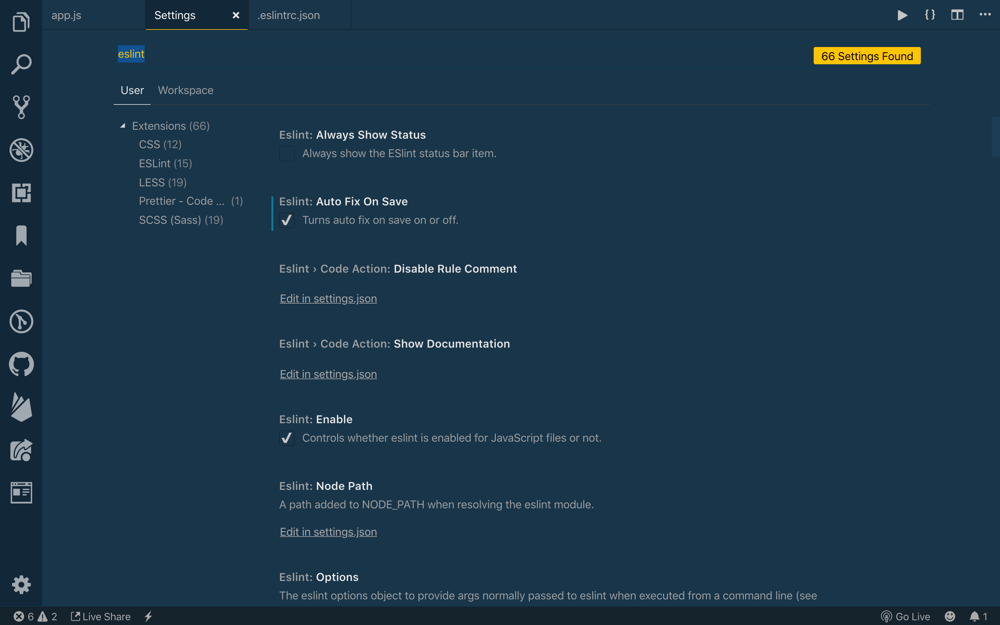

# HAC ESLint

## Installation

```
npm install --save-dev @robinblomberg/eslint-config-hac-eslint
```

## Configuration

Create a file called **.eslintrc.js** at the project root:

```javascript
module.exports = {
  extends: '@robinblomberg/hac-eslint'
}
```

## NPM scripts

Add the following scripts to your package.json:

```json
{
  "scripts": {
    "lint-scripts": "eslint \"**/*.{js,jsx,ts,tsx}\"",
    "lint-scripts-fix": "eslint \"**/*.{js,jsx,ts,tsx}\" --fix",
  }
}
```

Adjust the paths according to your project/file structure as necessary (e.g. `"eslint \"src/**/*.{ts,tsx}\""`).

To run a script, enter the following in your command line:

```
npm run lint-scripts
```

## Formatting on Save

With this knowledge of ESLint messages in mind, we can modify VS Code to tell ESLint to fix any issues (mainly formatting) every time we save. To open the settings menu, click on the gear icon in the lower left, and then choose **Settings**.

Within the settings menu, search for eslint. In the results, you will see a checkbox for **ESLint: Auto Fix on Save**. Make sure this is checked:



Now, save your JavaScript file. You should see some changes, including fewer squiggles.
